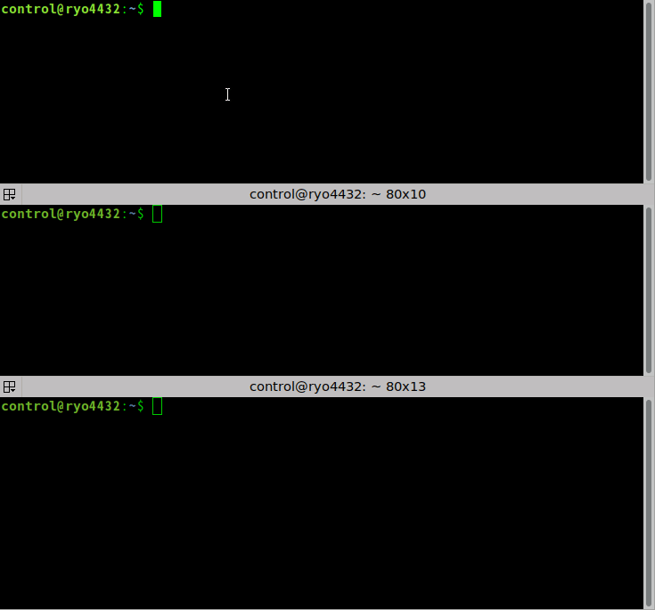
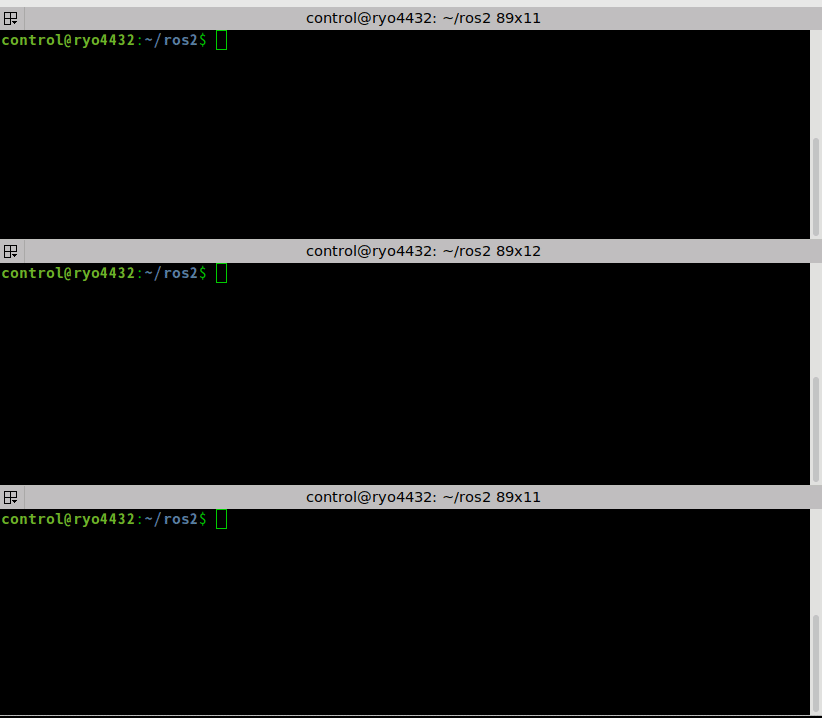
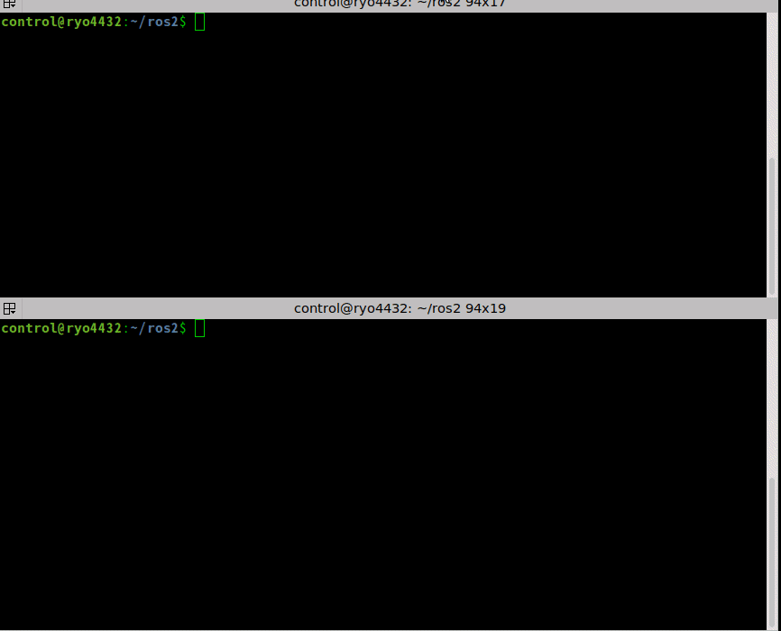
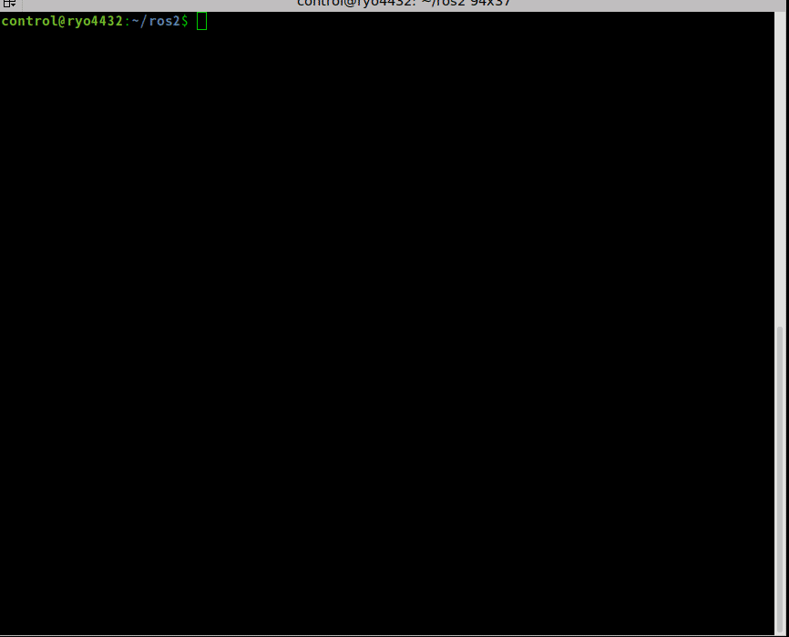

# lifecycle demo

## lifecycle talker + commandline

top: run lifecycle_talker
```
ros2 run tutorial_lifecycle lifecycle_talker
```

middle: check lifecycle state
```
ros2 lifecycle list /lc_talker
```

bottom: set state of lifecycle_talker
```
ros2 lifecycle set /lc_talker <lifecycle state>
```




## lifecycle talker + lifecycle listener + commandline

top: run lifecycle_talker
```
ros2 run tutorial_lifecycle lifecycle_talker
```

middle: run lifecycle_listener
```
ros2 run tutorial_lifecycle lifecycle_listener
```

bottom: check lifecycle state and set state of lifecycle_talker
```
ros2 lifecycle list /lc_talker
ros2 lifecycle set /lc_talker <lifecycle state>
```



## lifecycle talker + lifecycle service client

upper: run lifecycle_talker
```
ros2 run tutorial_lifecycle lifecycle_talker
```

lower: run lifecycle_service_client
```
ros2 run tutorial_lifecycle lifecycle_service_client
```



## launch

run launch file
```
ros2 launch tutorial_lifecycle lifecycle.launch.py
```


